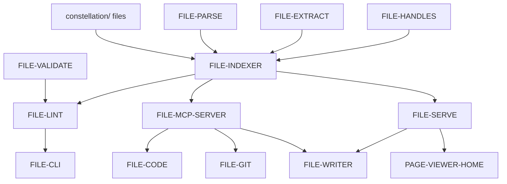

# Architecture

One direction: **files → index → (lint | serve | mcp)**. Every consumer reloads the index from
disk per operation, so it's always correct under parallel edits.

```mermaid
flowchart TD
  files["constellation/ files"] --> FILE-INDEXER
  FILE-PARSE --> FILE-INDEXER
  FILE-EXTRACT --> FILE-INDEXER
  FILE-HANDLES --> FILE-INDEXER
  FILE-VALIDATE --> FILE-LINT
  FILE-INDEXER --> FILE-LINT
  FILE-INDEXER --> FILE-MCP-SERVER
  FILE-INDEXER --> FILE-SERVE
  FILE-LINT --> FILE-CLI
  FILE-MCP-SERVER --> FILE-CODE
  FILE-MCP-SERVER --> FILE-GIT
  FILE-MCP-SERVER --> FILE-WRITER
  FILE-SERVE --> FILE-WRITER
  FILE-SERVE --> PAGE-VIEWER-HOME
```
