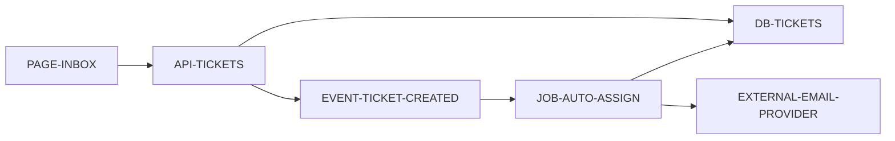

# System overview

```mermaid
flowchart LR
  PAGE-INBOX --> API-TICKETS
  API-TICKETS --> DB-TICKETS
  API-TICKETS --> EVENT-TICKET-CREATED
  EVENT-TICKET-CREATED --> JOB-AUTO-ASSIGN
  JOB-AUTO-ASSIGN --> DB-TICKETS
  JOB-AUTO-ASSIGN --> EXTERNAL-EMAIL-PROVIDER
```

Intake is synchronous down the left edge; everything after the event is
asynchronous. The job is the only component that talks to the email provider.
