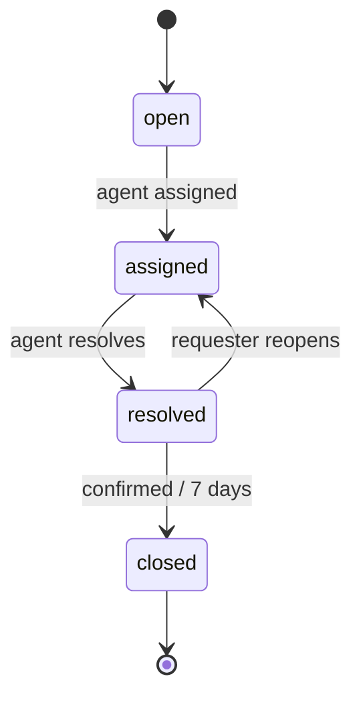

# Ticket lifecycle

```mermaid
stateDiagram-v2
  [*] --> open
  open --> assigned: agent assigned
  assigned --> resolved: agent resolves
  resolved --> assigned: requester reopens
  resolved --> closed: confirmed / 7 days
  closed --> [*]
```

The `status` column in the tickets table holds the current state; transitions are
enforced in the API layer, never by direct column updates.
