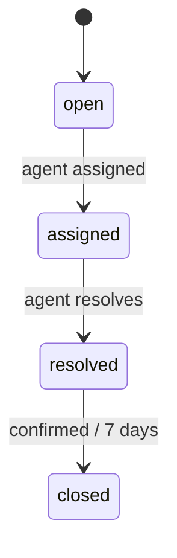

# STATE cards (`STATE-`, `state/`)

One card per state machine. Prefer a ` ```mermaid stateDiagram-v2 ` block in the
body; the structured frontmatter fields are optional, for tooling that needs them.

| Field | Type | Notes |
|---|---|---|
| `states` | array | `{ name, initial?, terminal? }` |
| `transitions` | array | `{ from, to, event? (handle), guard?, action? }` |

Example — `constellation/state/STATE-TICKET.md`:

````markdown
---
name: Ticket lifecycle
status: built
states:
  - { name: open, initial: true }
  - { name: assigned }
  - { name: resolved }
  - { name: closed, terminal: true }
transitions:
  - { from: open, to: assigned, action: notify assignee }
  - { from: resolved, to: closed, guard: requester confirms or 7 days pass }
connections:
  - DB-TICKETS
---



Transitions are enforced in the API layer, never by direct column updates.
````
